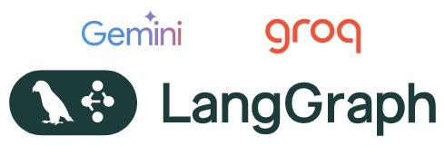
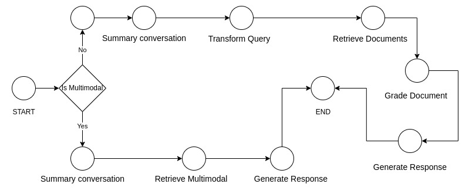
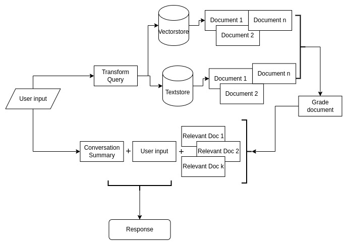
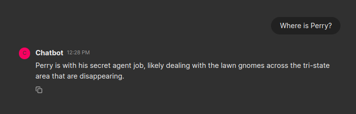
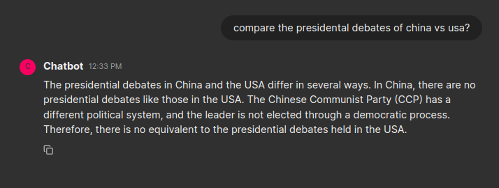
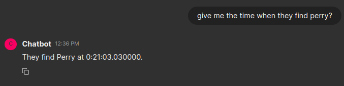
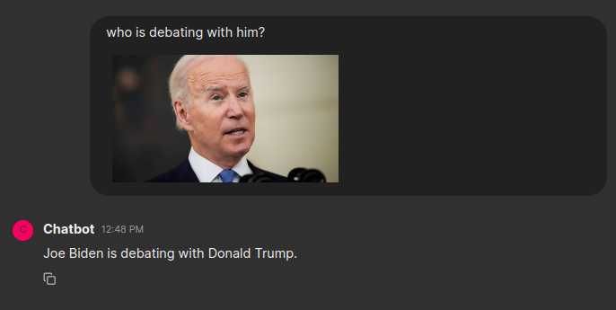

# Video Chatbot
<div align="center">

</div>

## Features
- [x] Support for YouTube video URLs
- [x] Support for video files
- [x] Chat over multiple videos
- [x] Chat with images (multimodal)
- [x] Summarize video content
- [x] Speech-to-text to extract video transcripts
- [x] Extract video frames

## Indexing


Here is our indexing pipeline:
- For each video or URL, we first download and convert it to MP3 for transcription and subtitles using the Whisper-large-v3 model.
- The Whisper-large-v3 model requires audio at 16kHz, so we convert the audio to 16kHz.
- For large audio files (>25MB), we split them into parts under 25MB, process each part, and then combine the results into a single transcript.
- We extract video frames, taking only 1 frame per second.
- Convert the transcript to SRT or VTT format.
- Summarize the transcript of the video using the GROQ/Llama3-8B model.
- Use Recursive Character Chunking with a chunk size of 300 and an overlap of 20 to chunk the transcript.
- For each chunked text, we use the embedding model from Google AI (text-embedding-004).
- Add text vectors to the vector store.
- For each frame, find the context and get the embedding using ImageBind ([ImageBind GitHub](https://github.com/facebookresearch/ImageBind)).
- Add context and image embeddings to the multimodal store.

## Chatbot
Here is the workflow for the chatbot: 


- We use LangGraph ([LangGraph](https://langchain-ai.github.io/langgraph/)) to implement the chatbot workflow. Here are the workflows for normal and multimodal queries:

- We primarily use Llama3-8B on GROQ for faster response times and text-embedding-004 for text embedding.

### Normal Query


The normal query workflow resembles the Adaptive RAG ([Adaptive RAG](https://arxiv.org/abs/2403.14403)) model but with some steps removed. Here are the details:

- **Summary Chat History**: Celery task to summarize the latest chat history to get the conversation context (Llama3-8B)
- **Reconstruct Query**: Create a different version of the input query that provides more meaning for semantic search (Llama3-8B)
- **Find Top K Documents in Semantic**: Retrieve the top K documents from the vector store rated by semantic similarity (From vector DB)
- **Find Top K Documents in Text-Based**: Retrieve the top K documents from the vector store rated by text similarity (From memery text index)
- **Grade Document**: Parallel check if the document is relevant to the user query (Llama3-8B)
- **Generate Response**: Generate the response based on the original user query and the graded document (Llama3-70B)

### Multimodal Query


When the input includes an image, we use the multimodal flow. This is a simplified flow where we use both image and text to obtain multimodal embeddings and then respond to the user query. Here are the details:
- **Summary Chat History**: Celery task to summarize the latest chat history to get the conversation context (Llama3-8B)
- **Find Top K Documents in Semantic**: Retrieve the top K documents from the vector store rated by semantic similarity (From vector DB)
- **Find Top K Documents in Image-Based**: Retrieve the top images from the image store and image context (ImageBind)
- **Generate Response**: Generate the response based on the original user query and the graded document (Gemini-1.5-flash)

## Video/Screen Shot





## Start Application

First, install the requirements and set up the environment:

```sh
pip install -r requirements.txt
```

Set up the environment variables:

```sh
GROQ_API_KEY=<your_groq_api_key>
LANGCHAIN_TRACING_V2=true # Optional for Langsmith tracing
LANGCHAIN_ENDPOINT=https://api.smith.langchain.com  # Optional for Langsmith tracing
LANGCHAIN_API_KEY=<your_langchain_api_key> # Optional for Langsmith tracing
LANGCHAIN_PROJECT=<your_langchain_project> # Optional for Langsmith tracing
GOOGLE_API_KEY=<your_google_api_key>
```

Start by downloading the data. Check the [videos.txt](videos.txt) for examples of YouTube video URLs and files, then run:

```sh
python -m src.cmd.download_data
```

Next, start indexing the text data:

```sh
python src.cmd.index_text
```

Next, start indexing multimodal data:

```sh
python src.cmd.index_multimodal
```

Finally, start the chatbot server:

```sh
chainlit run app.py
```

[//]: # (### Token Usage and Cost Analysis)

[//]: # ()
[//]: # (Check the Langsmith dashboard for models and token usage: [Langsmith Dashboard]&#40;https://smith.langchain.com/&#41;)